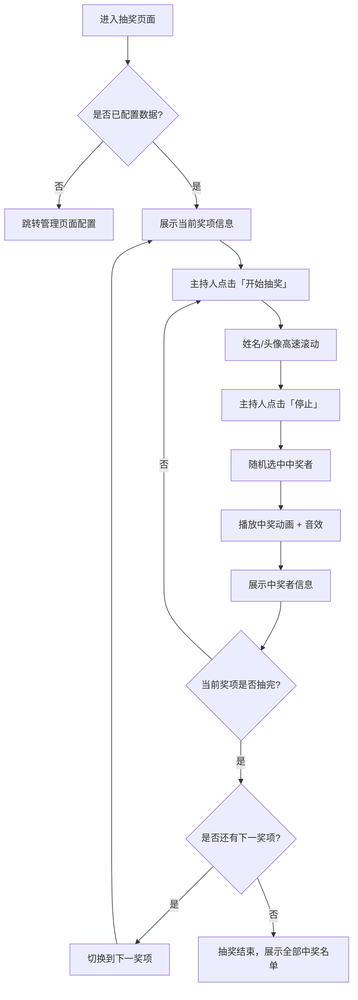
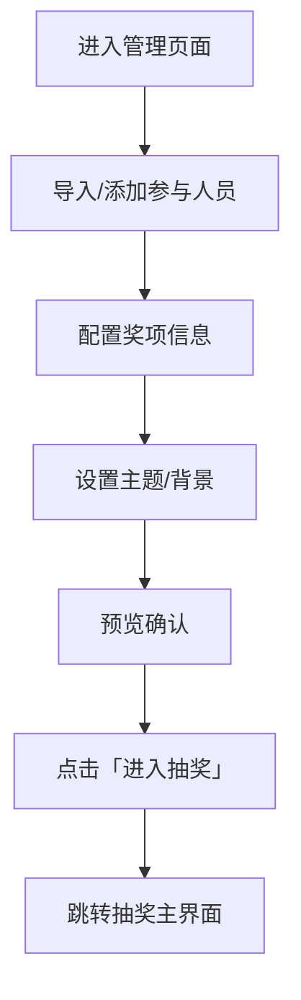

# 年会抽奖工具 — 需求设计文档

## 一、项目概述

### 1.1 项目背景

年会是企业每年一度的盛大活动，抽奖环节是年会中最具期待感和参与感的部分。传统的手工抽奖方式效率低、体验差，需要一款**视觉效果炫酷、操作简便、公平公正**的在线抽奖工具来提升年会氛围。

### 1.2 项目目标

开发一款基于 **Web 前端**的年会抽奖工具，支持：
- 多轮次、多奖项的灵活抽奖配置
- 炫酷的滚动动画效果（姓名/头像滚动）
- 大屏幕投屏展示，适配会场大屏
- 中奖结果实时展示与记录
- 操作简单，主持人一键抽奖
- 弹幕互动、二维码签到、多活动管理等丰富功能

### 1.3 技术选型

| 技术栈 | 说明 |
|--------|------|
| **HTML5 + CSS3 + JavaScript** | 核心前端页面 |
| **Vite** | 项目构建工具，支持热更新开发 |
| **Vanilla CSS** | 样式方案，实现炫酷视觉效果 |
| **LocalStorage / JSON** | 数据持久化（小型数据量） |

> [!NOTE]
> 本项目为纯前端项目，无需后端服务器，所有数据存储在浏览器本地或通过 JSON 文件导入，方便部署和离线使用。

---

## 二、功能需求

### 2.1 核心功能

#### 2.1.1 参与人员管理

| 功能点 | 说明 |
|--------|------|
| 导入人员名单 | 支持 JSON / CSV 文件批量导入（姓名、工号、部门、头像URL） |
| 手动添加/删除 | 支持在管理界面手动增删参与人员 |
| 人员去重 | 自动检测重复人员并提示 |
| 人员预览 | 展示当前参与抽奖的人员列表和总数 |

**人员数据结构：**
```json
{
  "id": "001",
  "name": "张三",
  "department": "技术部",
  "avatar": "avatars/zhangsan.jpg"
}
```

#### 2.1.2 奖项管理

| 功能点 | 说明 |
|--------|------|
| 配置奖项 | 支持自定义奖项名称、奖品描述、图片、中奖人数 |
| 多级奖项 | 支持特等奖、一等奖、二等奖、三等奖、幸运奖等多级别 |
| 奖项排序 | 可调整抽奖顺序（通常从小奖到大奖） |
| 奖项图标 | 每个奖项支持配置展示图标/图片 |

**奖项数据结构：**
```json
{
  "id": "prize_1",
  "level": "一等奖",
  "name": "iPhone 16 Pro",
  "description": "最新款苹果手机",
  "image": "prizes/iphone.jpg",
  "count": 1
}
```

#### 2.1.3 抽奖核心

| 功能点 | 说明 |
|--------|------|
| 滚动动画 | 点击「开始」后，人员姓名/头像高速滚动 |
| 停止抽奖 | 点击「停止」后，随机选中中奖者并展示结果 |
| 单人/多人抽取 | 支持一次抽取单人或多人 |
| 已中奖排除 | 默认开启，已中奖人员自动排除。亦可手动开启「重复中奖」模式允许连抽 |
| 随机算法 | 采用 `crypto.getRandomValues()` 确保真正随机 |
| 抽奖音效 | 滚动时播放紧张音效，中奖时播放庆祝音效 |

#### 2.1.4 中奖结果

| 功能点 | 说明 |
|--------|------|
| 结果展示 | 中奖后以动画形式展示中奖者信息 |
| 历史记录 | 记录每轮抽奖的中奖者和对应奖项 |
| 导出结果 | 支持将中奖结果导出为 CSV / JSON 文件 |
| 结果持久化 | 使用 LocalStorage 保存，刷新页面不丢失 |

### 2.2 辅助功能

#### 2.2.1 大屏展示模式

- 全屏展示，适配 16:9 / 21:9 等常见大屏比例
- 深色主题，适合会场灯光环境
- 字体大、动画流畅、视觉冲击力强
- 支持键盘快捷键控制（空格键 = 开始/停止）

#### 2.2.2 管理后台界面

- 独立的管理页面，用于配置人员和奖项
- 与抽奖展示页面分离，互不影响
- 操作简洁，支持拖拽排序

#### 2.2.3 主题与视觉定制

| 定制项 | 说明 |
|--------|------|
| 背景 | 支持自定义背景图片或渐变色 |
| 主题色 | 支持切换主题配色方案 |
| Logo | 支持上传公司 Logo 展示在抽奖页面 |
| 标题 | 支持自定义抽奖活动标题 |

---

## 三、页面设计

### 3.1 页面结构

```
├── 首页（抽奖主界面）     → index.html
├── 管理页面              → admin.html
└── 中奖记录页面           → results.html
```

### 3.2 抽奖主界面布局

```
┌──────────────────────────────────────────┐
│              公司 Logo + 活动标题          │
├──────────────────────────────────────────┤
│                                          │
│           当前奖项名称 & 奖品图片          │
│                                          │
├──────────────────────────────────────────┤
│                                          │
│     ┌─────┐  ┌─────┐  ┌─────┐          │
│     │ 头像 │  │ 头像 │  │ 头像 │  ← 滚动区│
│     │ 姓名 │  │ 姓名 │  │ 姓名 │          │
│     └─────┘  └─────┘  └─────┘          │
│                                          │
├──────────────────────────────────────────┤
│    [ 开始抽奖 ]        [ 下一奖项 ]       │
├──────────────────────────────────────────┤
│  已中奖名单（底部滚动展示）               │
└──────────────────────────────────────────┘
```

### 3.3 管理界面布局

```
┌──────────────────────────────────────────┐
│  侧边栏导航            主内容区           │
│  ┌──────────┐  ┌────────────────────┐   │
│  │ 人员管理  │  │                    │   │
│  │ 奖项设置  │  │   表单 / 表格区域   │   │
│  │ 主题设置  │  │                    │   │
│  │ 抽奖记录  │  │                    │   │
│  │ 进入抽奖  │  │                    │   │
│  └──────────┘  └────────────────────┘   │
└──────────────────────────────────────────┘
```

---

## 四、视觉设计规范

> [!IMPORTANT]
> 设计风格参考 Apple、Google 等大厂年会/发布会视觉规范，追求简洁、高级、沉浸式的观感体验。

### 4.1 设计理念

- **极简高级感**：遵循苹果式"少即是多"原则，大量留白，信息层级分明
- **深色沉浸式**：深色背景搭配精致光影，营造会场沉浸氛围
- **毛玻璃质感**：借鉴 iOS 磨砂玻璃（Frosted Glass）效果，为浮层和卡片增添高级层次感
- **克制的动效**：动画流畅但不花哨，服务于功能而非炫技

### 4.2 配色方案

**主配色 — 深空灰 + 午夜蓝 + 冷金属调**

| 用途 | 颜色名称 | 色值 | 说明 |
|------|----------|------|------|
| 背景主色 | 午夜黑 | `#0c0c0e` | 接近纯黑，OLED 友好，苹果深色模式基调 |
| 背景辅色 | 深空灰 | `#1c1c1e` | Apple 系统级深色背景色 |
| 表面层色 | 烟灰 | `#2c2c2e` | 卡片/浮层背景，制造深度层级 |
| 分割线色 | 冷灰 | `#38383a` | 边框、分割线等辅助元素 |
| 强调主色 | 琥珀金 | `#c9a84c` | 低饱和度金色，高级感远优于纯金色 |
| 强调辅色 | 香槟金 | `#d4af61` | 金色悬浮/高亮状态 |
| 强调渐变 | 金属渐变 | `#c9a84c` → `#e8cc73` | 用于按钮和重要元素的渐变效果 |
| 中奖高亮 | 暖光金 | `#f5d77a` | 中奖时的光晕和文字高亮 |
| 功能蓝 | 科技蓝 | `#0a84ff` | Apple 标准蓝，用于链接和次要交互 |
| 成功色 | 翡翠绿 | `#30d158` | 成功提示、完成状态 |
| 警告色 | 琥珀橙 | `#ff9f0a` | 警告信息 |
| 危险色 | 珊瑚红 | `#ff453a` | 错误/删除操作 |
| 文字主色 | 纯白 | `#f5f5f7` | Apple 标准前景白（非纯白，更柔和） |
| 文字辅色 | 银灰 | `#86868b` | Apple 标准次级文字灰 |
| 文字三级 | 暗灰 | `#48484a` | 提示文字、占位符 |

### 4.3 字体规范

| 场景 | 字体 | 字重 | 大小 |
|------|------|------|------|
| 活动标题 | SF Pro Display / Outfit | Bold (700) | 48-64px |
| 奖项名称 | SF Pro Display / Outfit | Semibold (600) | 32-40px |
| 中奖姓名 | SF Pro Display / Outfit | Bold (700) | 36-48px |
| 正文信息 | SF Pro Text / Inter | Regular (400) | 16-18px |
| 辅助信息 | SF Pro Text / Inter | Regular (400) | 13-14px |
| 中文字体降级 | PingFang SC / 苹方 | — | 跟随英文字号 |

> [!TIP]
> 字体加载策略：优先使用系统字体（SF Pro），降级方案为 Google Fonts（Outfit + Inter），确保离线可用。

### 4.4 毛玻璃与层级系统

```css
/* 毛玻璃效果层级 */
--glass-light:   background: rgba(255,255,255, 0.05); backdrop-filter: blur(20px);
--glass-medium:  background: rgba(255,255,255, 0.08); backdrop-filter: blur(40px);
--glass-heavy:   background: rgba(255,255,255, 0.12); backdrop-filter: blur(60px);

/* 层级阴影 */
--shadow-sm:  0 2px 8px rgba(0,0,0, 0.3);
--shadow-md:  0 8px 24px rgba(0,0,0, 0.4);
--shadow-lg:  0 16px 48px rgba(0,0,0, 0.5);
--shadow-glow: 0 0 40px rgba(201,168,76, 0.15);  /* 金色光晕 */
```

### 4.5 动画效果

| 动画 | 说明 | 参考 |
|------|------|------|
| 姓名/头像滚动 | 3D 透视滚动，速度从快到慢（缓动函数：cubic-bezier） | Apple 发布会数字滚动效果 |
| 中奖揭晓 | 缩放弹出 + 柔和金色光晕 + 细腻粒子散射 | Apple "It's Glowtime" 光效 |
| 背景粒子 | 极低密度的微光粒子缓慢飘动，色温偏暖金 | Apple 发布会舞台光效 |
| 毛玻璃过渡 | 模糊度和透明度的平滑过渡（300ms ease-out） | iOS 页面切换 |
| 按钮交互 | scale(0.97) 按下 + 微弱光晕扩散 | Apple 按钮反馈 |
| 奖项切换 | 上下滑入 + 淡入淡出（500ms ease-in-out） | Apple Keynote 过渡 |
| 数字计数器 | 数字从 0 快速滚动到目标值（剩余人数等） | Apple 官网数据展示 |

---

## 五、项目文件结构

```
Annual_party_lottery/
├── index.html              # 抽奖主界面
├── admin.html              # 管理后台
├── results.html            # 中奖记录页面
├── css/
│   ├── reset.css           # 样式重置
│   ├── variables.css       # CSS 变量（主题色、字体、毛玻璃）
│   ├── main.css            # 抽奖主界面样式
│   ├── admin.css           # 管理界面样式
│   ├── animations.css      # 动画效果
│   ├── glass.css           # 毛玻璃组件样式
│   └── results.css         # 中奖记录样式
├── js/
│   ├── app.js              # 抽奖主逻辑
│   ├── admin.js            # 管理界面逻辑
│   ├── lottery.js          # 抽奖核心算法
│   ├── storage.js          # 数据存储管理
│   ├── particles.js        # 粒子动画效果
│   ├── sound.js            # 音效管理
│   ├── export.js           # 数据导出
│   ├── danmaku.js          # 弹幕系统
│   ├── qrcode.js           # 二维码签到
│   ├── sync.js             # 实时投屏同步
│   ├── audit.js            # 操作日志/作弊检测
│   └── activity.js         # 多活动管理
├── assets/
│   ├── sounds/             # 音效文件
│   │   ├── rolling.mp3     # 滚动音效
│   │   └── win.mp3         # 中奖音效
│   ├── images/             # 图片资源
│   │   └── default-bg.jpg  # 默认背景
│   └── avatars/            # 头像目录
├── data/
│   └── sample.json         # 示例人员数据
├── docs/
│   └── 01_年会抽奖工具需求设计文档.md
├── vite.config.js          # Vite 配置
├── package.json            # 项目依赖
└── README.md               # 项目说明
```

---

## 六、交互流程

### 6.1 主抽奖流程



### 6.2 管理配置流程



---

## 七、非功能需求

| 需求类别 | 要求 |
|----------|------|
| **性能** | 500 人以内流畅运行，动画帧率 >= 60fps |
| **兼容性** | 支持 Chrome、Edge、Firefox 等主流浏览器 |
| **响应式** | 适配从 1080p 到 4K 的不同分辨率屏幕 |
| **公平性** | 使用加密安全的随机数生成器 |
| **可靠性** | 数据本地持久化，刷新/断电不丢失中奖结果 |
| **易用性** | 主持人无需技术背景即可操作 |
| **离线运行** | 纯前端项目，无需联网即可使用 |

---

## 八、开发计划

| 阶段 | 内容 | 预计耗时 |
|------|------|----------|
| **第一阶段** | 项目搭建 + 数据管理模块（storage / 人员 / 奖项 / 多活动） | 1 天 |
| **第二阶段** | 抽奖核心逻辑 + 基础 UI 界面（Apple 风格） | 1 天 |
| **第三阶段** | 动画效果 + 粒子特效 + 音效 + 毛玻璃组件 | 1 天 |
| **第四阶段** | 管理后台界面 + 多活动管理 | 1 天 |
| **第五阶段** | 弹幕互动 + 二维码签到 + 实时投屏同步 | 1 天 |
| **第六阶段** | 操作日志/作弊检测 + 微信小程序适配页面 | 1 天 |
| **第七阶段** | 主题定制 + 响应式适配 + 全面测试优化 | 1 天 |

---

## 九、进阶功能模块

以下功能全部纳入基础版本，与核心抽奖功能一同交付：

### 9.1 弹幕互动系统

| 功能点 | 说明 |
|--------|------|
| 弹幕发送 | 观众通过手机端页面发送弹幕文字 |
| 大屏展示 | 弹幕以半透明浮动文字形式飘过抽奖大屏 |
| 弹幕过滤 | 支持关键词过滤，屏蔽不当内容 |
| 弹幕控制 | 主持人可一键开启/关闭弹幕 |
| 弹幕样式 | 支持彩色弹幕、渐变弹幕等多种样式 |

### 9.2 二维码签到

| 功能点 | 说明 |
|--------|------|
| 生成签到码 | 管理界面生成活动专属二维码 |
| 扫码签到 | 参与者扫码填写姓名/工号后自动加入抽奖池 |
| 签到统计 | 实时显示已签到人数和签到率 |
| 防重复签到 | 通过设备指纹或工号防止重复签到 |

### 9.3 实时投屏同步

| 功能点 | 说明 |
|--------|------|
| 多端同步 | 主控端操作实时同步到所有观看端 |
| WebSocket 通信 | 使用 WebSocket 实现低延迟实时通信 |
| 观众端页面 | 提供简化版观众端页面，展示抽奖实况 |
| 连接管理 | 显示当前在线观看人数 |

### 9.4 操作日志与作弊检测

| 功能点 | 说明 |
|--------|------|
| 操作日志 | 记录所有抽奖操作的时间、操作人、结果 |
| 日志导出 | 支持导出完整操作日志 |
| 随机数验证 | 记录每次抽奖的随机种子，支持事后复验 |
| 异常检测 | 检测短时间内频繁重抽等异常行为并预警 |

### 9.5 多活动管理

| 功能点 | 说明 |
|--------|------|
| 创建活动 | 支持创建多个独立的抽奖活动 |
| 标题同步 | 修改活动大屏标题时，后台活动列表名称自动联动更新 |
| 数据隔离 | 每个活动有独立的人员、奖项和中奖记录，切换活动即进入独立沙箱 |
| 关联清除 | 清空人员/奖项时自动销毁该场次的中奖记录，保持统计逻辑一致 |
| 活动归档 | 已结束的活动可归档保存 |

### 9.6 微信小程序适配

| 功能点 | 说明 |
|--------|------|
| 移动端适配页面 | 提供针对手机浏览器优化的 H5 页面 |
| 中奖查询 | 参与者可通过手机查看自己是否中奖 |
| 分享功能 | 中奖者可生成中奖海报分享到社交平台 |
